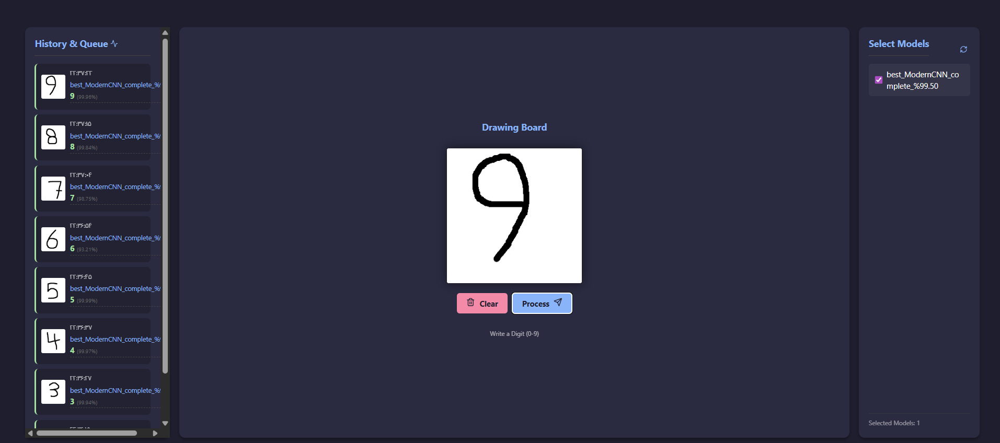

# 🚀 Hybrid-ModernCNN Digit Recognition Framework


> **A full-stack Deep Learning framework designed for building, testing, and deploying state-of-the-art digit recognition models.**

---

## 📋 Table of Contents
1. [Project Overview](#-project-overview)
2. [Project Metadata](#-project-metadata)
3. [Key Features](#-key-features)
4. [Architecture & Methodology](#-architecture--methodology)
5. [Performance & Results](#-performance--results)
6. [Installation & Usage](#-installation--usage)
7. [The Mission](#-the-mission)
8. [About the Author](#-about-the-author)

---

## 🔭 Project Overview

**Hybrid-ModernCNN** is not just a classification model; it is a comprehensive testbed for Computer Vision experimentation. It combines a high-performance backend (PyTorch/FastAPI) with an interactive React frontend, allowing users to draw digits in real-time and see immediate predictions.

The core utilizes a **Modern Hybrid Architecture**, merging the residual learning of **ResNet** with the design philosophy of **ConvNeXt**. It is optimized for real-world handwriting, handling irregular strokes, varying thickness, and noise through a robust preprocessing pipeline.

### 📸 Interface Preview

*The interactive drawing board featuring real-time inference and ensemble predictions.*

---

## 🛠 Project Metadata

| Attribute | Details |
| :--- | :--- |
| **Author** | **Sobhan Nasiri** |
| **Major** | Computer Engineering |
| **Current Version** | 1.0.0-Stable |
| **Last Update** | February 2026 |
| **Frameworks** | PyTorch, FastAPI, React.js, OpenCV |
| **License** | [MIT](https://choosealicense.com/licenses/mit/) |

---

## 🌟 Key Features

### 🧠 Advanced Deep Learning
- **Modern Architecture:** Custom block design utilizing **Depthwise Convolutions**, **GELU** activation, and **LayerNorm2d** for stable training.
- **Ensemble-Ready:** Includes a dedicated `Inference_Handler` class capable of combining multiple models (Soft Voting) to maximize accuracy.
- **Large Kernel Design:** Uses 7x7 kernels to expand the Receptive Field, mimicking the global attention mechanisms found in Vision Transformers.

### 🛡️ Robust Preprocessing Pipeline
Real-world data is messy. This project uses OpenCV to standardize user inputs:
- **Auto-Centering:** Centers the digit based on center-of-mass.
- **Padding & Resizing:** Maintains aspect ratio while resizing to 28x28.
- **Data Augmentation:** Salt & Pepper noise, Gaussian Blur, and Soft Dilation to simulate ink spread.


*Final quality check: Visualizing correct orientation and realistic noise simulation.*

---

## 🏗 Architecture & Methodology

The model consists of **Modern Blocks** designed to overcome the limitations of standard CNNs:

1.  **Residual Connections:** Prevents gradient vanishing, allowing for deeper networks.
2.  **Inverted Bottleneck:** Expands channels by 4x inside the block to increase feature extraction capacity before projecting back.
3.  **Modern Components:** Replaces standard BatchNorm/ReLU with **LayerNorm** and **GELU**, aligning with state-of-the-art ConvNeXt designs.

---

## 📊 Performance & Results

The model achieves exceptional accuracy on the validation set, demonstrating the effectiveness of the hybrid architecture.

- **Peak Accuracy:** **99.50% - 99.54%**
- **Training Efficiency:** Optimized DataLoaders with `num_workers=8` and `pin_memory=True`.


*Training logs showing convergence to >99.5% accuracy.*

---

## 💻 Installation & Usage

This project is split into a Python backend and a React frontend. Follow the steps below to get the system running.

### 1. Backend Setup (Python/FastAPI)
Navigate to the backend directory and start the Uvicorn server:

```bash
cd Digits_backend
# Install dependencies (if not already done)
pip install -r requirements.txt

# Run the server
uvicorn main:app --reload

2. Frontend Setup (React)
Open a new terminal, navigate to the frontend directory, and start the development server:

cd digits_frontend
# Install dependencies
npm install

# Run the application
npm run dev

Note: Once both servers are running, open the localhost link provided by the frontend terminal (usually http://localhost:5173) to access the application.

🎯 The Mission
Why was this built?

The primary goal of this project is to provide a modular framework for students and researchers interested in the MNIST dataset and digit recognition.

Instead of building a UI and preprocessing pipeline from scratch, you can use this project as a foundation. It provides:

Ready-to-use Training Loops: Just define your model.

Optimized DataLoaders: Pre-configured for performance.

Interactive Testing: A draw-and-predict interface to test your model against real human handwriting immediately.

You focus on the architecture; this framework handles the rest.

👨‍💻 About the Author
Sobhan Nasiri
Computer Engineering Student (Term 4)

Passionate about Computer Vision and Deep Learning. This project represents a deep dive into modern neural network architectures, moving beyond basic tutorials to implement research-grade concepts like Inverted Bottlenecks and Ensemble Inference.

© 2026 Sobhan Nasiri. Licensed under MIT.

### 💡 Suggestions for your Images (Placement Guide)

I have embedded the placeholders in the code above, but here is a quick summary of where to put your files to match the context:

1.  **`image_3f5aff.png` (The Web UI):**
    * **Where:** Under the **Project Overview** section.
    * **Why:** This is the "Hook". It shows the user exactly what the final product looks like immediately.

2.  **`Figure_1.png` (The Grid of Numbers):**
    * **Where:** Under **Key Features** -> **Robust Preprocessing Pipeline**.
    * **Why:** It visually proves your claim about "Standardizing irregular inputs" and "Data Augmentation."

3.  **`Screenshot 2026-02-14...` (The Black Terminal Logs):**
    * **Where:** Under **Performance & Results**.
    * **Why:** This screenshot looks slightly more professional and "hacker-like" than the white IDE screenshot, and it clearly shows the 99.50% result.

### How to use this:
1.  Create a file named `README.md` in your project root.
2.  Copy the code block above.
3.  Ensure your images (`Figure_1.png`, etc.) are in the same folder as the README, or inside an `images/` folder (if so, update the links in the code like `images/Figure_1.png`).